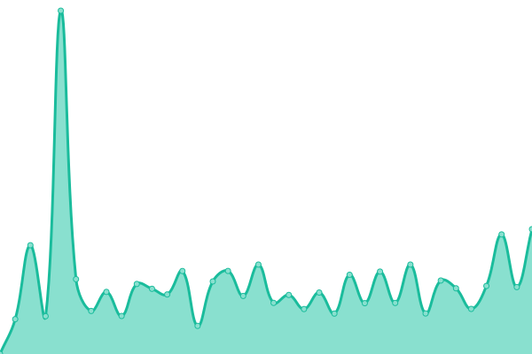

# [📈 Live Status](https://UnSeulT.github.io/upptime): <!--live status--> **🟧 Partial outage**

This repository contains the open-source uptime monitor and status page for [Mathieu](unseult.net), powered by [Upptime](https://github.com/upptime/upptime).

With [Upptime](https://upptime.js.org), you can get your own unlimited and free uptime monitor and status page, powered entirely by a GitHub repository. We use [Issues](https://github.com/UnSeulT/upptime/issues) as incident reports, [Actions](https://github.com/UnSeulT/upptime/actions) as uptime monitors, and [Pages](https://UnSeulT.github.io/upptime) for the status page.

<!--start: status pages-->
<!-- This summary is generated by Upptime (https://github.com/upptime/upptime) -->
<!-- Do not edit this manually, your changes will be overwritten -->
<!-- prettier-ignore -->
| URL | Status | History | Response Time | Uptime |
| --- | ------ | ------- | ------------- | ------ |
|  [InterAFOCG](https://interafocg.org/) | 🟥 Down | [inter-afocg.yml](https://github.com/UnSeulT/upptime/commits/HEAD/history/inter-afocg.yml) | 

 1404ms
     
 | 

<a href="https://UnSeulT.github.io/upptime/history/inter-afocg">95.73%</a>
    

|  [AMAP IdF](https://amap-idf.org/) | 🟩 Up | [amap-id-f.yml](https://github.com/UnSeulT/upptime/commits/HEAD/history/amap-id-f.yml) | 

 1058ms
     
 | 

<a href="https://UnSeulT.github.io/upptime/history/amap-id-f">100.00%</a>
    

|  [AMAPartage](https://amapartage.fr/) | 🟥 Down | [ama-partage.yml](https://github.com/UnSeulT/upptime/commits/HEAD/history/ama-partage.yml) | 

 868ms
     
 | 

<a href="https://UnSeulT.github.io/upptime/history/ama-partage">96.01%</a>
    

|  [Bio 34](https://bio34.com/) | 🟩 Up | [bio-34.yml](https://github.com/UnSeulT/upptime/commits/HEAD/history/bio-34.yml) | 

 890ms
     
 | 

<a href="https://UnSeulT.github.io/upptime/history/bio-34">100.00%</a>
    

|  [Solidarité Paysans](https://solidaritepaysans.org/) | 🟩 Up | [solidarite-paysans.yml](https://github.com/UnSeulT/upptime/commits/HEAD/history/solidarite-paysans.yml) | 

 1976ms
     
 | 

<a href="https://UnSeulT.github.io/upptime/history/solidarite-paysans">100.00%</a>
    

|  [Emmaüs Le Maquis](https://emmauslemaquis.org/) | 🟩 Up | [emmaues-le-maquis.yml](https://github.com/UnSeulT/upptime/commits/HEAD/history/emmaues-le-maquis.yml) | 

 1289ms
     
 | 

<a href="https://UnSeulT.github.io/upptime/history/emmaues-le-maquis">100.00%</a>
    

|  [Solagro](https://solagro.org) | 🟩 Up | [solagro.yml](https://github.com/UnSeulT/upptime/commits/HEAD/history/solagro.yml) | 

 919ms
     
 | 

<a href="https://UnSeulT.github.io/upptime/history/solagro">99.38%</a>
    

|  [Afterres](https://afterres.org) | 🟩 Up | [afterres.yml](https://github.com/UnSeulT/upptime/commits/HEAD/history/afterres.yml) | 

 1718ms
     
 | 

<a href="https://UnSeulT.github.io/upptime/history/afterres">100.00%</a>
    

|  [Metha BFC](https://methabfc.fr/) | 🟩 Up | [metha-bfc.yml](https://github.com/UnSeulT/upptime/commits/HEAD/history/metha-bfc.yml) | 

 1987ms
     
 | 

<a href="https://UnSeulT.github.io/upptime/history/metha-bfc">100.00%</a>
    

|  [Junior Association RNJA](https://juniorassociation.org/) | 🟩 Up | [junior-association-rnja.yml](https://github.com/UnSeulT/upptime/commits/HEAD/history/junior-association-rnja.yml) | 

 981ms
     
 | 

<a href="https://UnSeulT.github.io/upptime/history/junior-association-rnja">100.00%</a>
    

|  [Choeur à l'ouvrage](https://choeuralouvrage.org/) | 🟩 Up | [choeur-a-l-ouvrage.yml](https://github.com/UnSeulT/upptime/commits/HEAD/history/choeur-a-l-ouvrage.yml) | 

 1122ms
     
 | 

<a href="https://UnSeulT.github.io/upptime/history/choeur-a-l-ouvrage">99.53%</a>
    

|  [La place de la danse](https://laplacedeladanse.com) | 🟩 Up | [la-place-de-la-danse.yml](https://github.com/UnSeulT/upptime/commits/HEAD/history/la-place-de-la-danse.yml) | 

 816ms
     
 | 

<a href="https://UnSeulT.github.io/upptime/history/la-place-de-la-danse">92.71%</a>
    

|  [LMAC](https://reseau-lmac.fr) | 🟩 Up | [lmac.yml](https://github.com/UnSeulT/upptime/commits/HEAD/history/lmac.yml) | 

 2127ms
     
 | 

<a href="https://UnSeulT.github.io/upptime/history/lmac">100.00%</a>
    

|  [Dom Robert](https://www.domrobert.com/) | 🟩 Up | [dom-robert.yml](https://github.com/UnSeulT/upptime/commits/HEAD/history/dom-robert.yml) | 

 1438ms
     
 | 

<a href="https://UnSeulT.github.io/upptime/history/dom-robert">100.00%</a>
    

|  [Encalcat Abbaye](https://encalcat.com) | 🟩 Up | [encalcat-abbaye.yml](https://github.com/UnSeulT/upptime/commits/HEAD/history/encalcat-abbaye.yml) | 

 3264ms
     
 | 

<a href="https://UnSeulT.github.io/upptime/history/encalcat-abbaye">100.00%</a>
    

|  [Encalcat Boutique](https://boutique.encalcat.com) | 🟩 Up | [encalcat-boutique.yml](https://github.com/UnSeulT/upptime/commits/HEAD/history/encalcat-boutique.yml) | 

 2790ms
     
 | 

<a href="https://UnSeulT.github.io/upptime/history/encalcat-boutique">99.70%</a>
    

|  [Bénédictines Dourgne](https://benedictines-dourgne.org/) | 🟩 Up | [benedictines-dourgne.yml](https://github.com/UnSeulT/upptime/commits/HEAD/history/benedictines-dourgne.yml) | 

 876ms
     
 | 

<a href="https://UnSeulT.github.io/upptime/history/benedictines-dourgne">100.00%</a>
    

|  [Cocagne Acepp 31](https://cocagne31.org) | 🟩 Up | [cocagne-acepp-31.yml](https://github.com/UnSeulT/upptime/commits/HEAD/history/cocagne-acepp-31.yml) | 

 1834ms
     
 | 

<a href="https://UnSeulT.github.io/upptime/history/cocagne-acepp-31">100.00%</a>
    

|  [Moodle - Cocagne Acepp 31](https://moodle.cocagne31.org) | 🟩 Up | [moodle-cocagne-acepp-31.yml](https://github.com/UnSeulT/upptime/commits/HEAD/history/moodle-cocagne-acepp-31.yml) | 

 697ms
     
 | 

<a href="https://UnSeulT.github.io/upptime/history/moodle-cocagne-acepp-31">100.00%</a>
    

|  [Accueil pour tous](https://accueilpourtous31.fr) | 🟩 Up | [accueil-pour-tous.yml](https://github.com/UnSeulT/upptime/commits/HEAD/history/accueil-pour-tous.yml) | 

 1163ms
     
 | 

<a href="https://UnSeulT.github.io/upptime/history/accueil-pour-tous">100.00%</a>
    

|  [Bujinkan Toulouse](https://bujinkan-toulouse.com) | 🟩 Up | [bujinkan-toulouse.yml](https://github.com/UnSeulT/upptime/commits/HEAD/history/bujinkan-toulouse.yml) | 

 1316ms
     
 | 

<a href="https://UnSeulT.github.io/upptime/history/bujinkan-toulouse">100.00%</a>
    

<!--end: status pages-->

[**Visit our status website →**](https://UnSeulT.github.io/upptime)

## 📄 License

- Powered by: [Upptime](https://github.com/upptime/upptime)
- Code: [MIT](./LICENSE) © [Mathieu](unseult.net)
- Data in the `./history` directory: [Open Database License](https://opendatacommons.org/licenses/odbl/1-0/)
