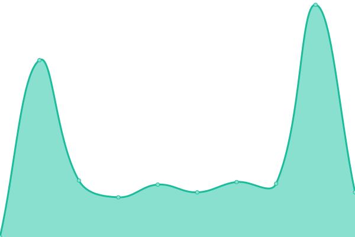
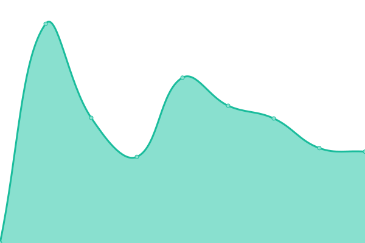

# [📈 Live Status](https://UnSeulT.github.io/upptime): <!--live status--> **🟩 All systems operational**

This repository contains the open-source uptime monitor and status page for [Mathieu](unseult.net), powered by [Upptime](https://github.com/upptime/upptime).

With [Upptime](https://upptime.js.org), you can get your own unlimited and free uptime monitor and status page, powered entirely by a GitHub repository. We use [Issues](https://github.com/UnSeulT/upptime/issues) as incident reports, [Actions](https://github.com/UnSeulT/upptime/actions) as uptime monitors, and [Pages](https://UnSeulT.github.io/upptime) for the status page.

<!--start: status pages-->
<!-- This summary is generated by Upptime (https://github.com/upptime/upptime) -->
<!-- Do not edit this manually, your changes will be overwritten -->
<!-- prettier-ignore -->
| URL | Status | History | Response Time | Uptime |
| --- | ------ | ------- | ------------- | ------ |
|  [Solagro](https://solagro.org) | 🟩 Up | [solagro.yml](https://github.com/UnSeulT/upptime/commits/HEAD/history/solagro.yml) | 

 1903ms
     
 | 

<a href="https://UnSeulT.github.io/upptime/history/solagro">100.00%</a>
    

|  [Osae](https://osez-agroecologie.org) | 🟩 Up | [osae.yml](https://github.com/UnSeulT/upptime/commits/HEAD/history/osae.yml) | 

 1440ms
     
 | 

<a href="https://UnSeulT.github.io/upptime/history/osae">100.00%</a>
    

|  [Afterres 2050](http://afterres2050.solagro.org) | 🟩 Up | [afterres-2050.yml](https://github.com/UnSeulT/upptime/commits/HEAD/history/afterres-2050.yml) | 

 3508ms
     
 | 

<a href="https://UnSeulT.github.io/upptime/history/afterres-2050">99.32%</a>
    

|  [Encalcat Abbaye](https://encalcat.com) | 🟩 Up | [encalcat-abbaye.yml](https://github.com/UnSeulT/upptime/commits/HEAD/history/encalcat-abbaye.yml) | 

 908ms
     
 | 

<a href="https://UnSeulT.github.io/upptime/history/encalcat-abbaye">100.00%</a>
    

|  [Encalcat Boutique](https://boutique.encalcat.com) | 🟩 Up | [encalcat-boutique.yml](https://github.com/UnSeulT/upptime/commits/HEAD/history/encalcat-boutique.yml) | 

 1132ms
     
 | 

<a href="https://UnSeulT.github.io/upptime/history/encalcat-boutique">100.00%</a>
    

|  [Dom Robert](https://www.domrobert.com/) | 🟩 Up | [dom-robert.yml](https://github.com/UnSeulT/upptime/commits/HEAD/history/dom-robert.yml) | 

 1405ms
     
 | 

<a href="https://UnSeulT.github.io/upptime/history/dom-robert">100.00%</a>
    

|  [Graines del Païs](https://grainesdelpais.com/) | 🟩 Up | [graines-del-pais.yml](https://github.com/UnSeulT/upptime/commits/HEAD/history/graines-del-pais.yml) | 

 1254ms
     
 | 

<a href="https://UnSeulT.github.io/upptime/history/graines-del-pais">100.00%</a>
    

|  [LMAC](https://reseau-lmac.fr) | 🟩 Up | [lmac.yml](https://github.com/UnSeulT/upptime/commits/HEAD/history/lmac.yml) | 

 943ms
     
 | 

<a href="https://UnSeulT.github.io/upptime/history/lmac">99.81%</a>
    

|  [La place de la danse](https://laplacedeladanse.com) | 🟩 Up | [la-place-de-la-danse.yml](https://github.com/UnSeulT/upptime/commits/HEAD/history/la-place-de-la-danse.yml) | 

 1121ms
     
 | 

<a href="https://UnSeulT.github.io/upptime/history/la-place-de-la-danse">100.00%</a>
    

|  [Fondation Écureuil](https://caisseepargne-art-contemporain.fr/) | 🟩 Up | [fondation-ecureuil.yml](https://github.com/UnSeulT/upptime/commits/HEAD/history/fondation-ecureuil.yml) | 

 1462ms
     
 | 

<a href="https://UnSeulT.github.io/upptime/history/fondation-ecureuil">100.00%</a>
    

|  [Biaugerme](https://www.biaugerme.com/) | 🟩 Up | [biaugerme.yml](https://github.com/UnSeulT/upptime/commits/HEAD/history/biaugerme.yml) | 

 1074ms
     
 | 

<a href="https://UnSeulT.github.io/upptime/history/biaugerme">100.00%</a>
    

|  [Junior Association RNJA](https://juniorassociation.org/) | 🟩 Up | [junior-association-rnja.yml](https://github.com/UnSeulT/upptime/commits/HEAD/history/junior-association-rnja.yml) | 

 1140ms
     
 | 

<a href="https://UnSeulT.github.io/upptime/history/junior-association-rnja">99.81%</a>
    

|  [Bio 34](https://bio34.com/) | 🟩 Up | [bio-34.yml](https://github.com/UnSeulT/upptime/commits/HEAD/history/bio-34.yml) | 

 896ms
     
 | 

<a href="https://UnSeulT.github.io/upptime/history/bio-34">100.00%</a>
    

|  [Cocagne Acepp 31](https://cocagne31.org) | 🟩 Up | [cocagne-acepp-31.yml](https://github.com/UnSeulT/upptime/commits/HEAD/history/cocagne-acepp-31.yml) | 

 881ms
     
 | 

<a href="https://UnSeulT.github.io/upptime/history/cocagne-acepp-31">100.00%</a>
    

|  [Moodle - Cocagne Acepp 31](https://moodle.cocagne31.org) | 🟩 Up | [moodle-cocagne-acepp-31.yml](https://github.com/UnSeulT/upptime/commits/HEAD/history/moodle-cocagne-acepp-31.yml) | 

 668ms
     
 | 

<a href="https://UnSeulT.github.io/upptime/history/moodle-cocagne-acepp-31">100.00%</a>
    

|  [Accueil pour tous](https://accueilpourtous31.fr) | 🟩 Up | [accueil-pour-tous.yml](https://github.com/UnSeulT/upptime/commits/HEAD/history/accueil-pour-tous.yml) | 

 841ms
     
 | 

<a href="https://UnSeulT.github.io/upptime/history/accueil-pour-tous">100.00%</a>
    

|  [Tau](https://tau.so) | 🟩 Up | [tau.yml](https://github.com/UnSeulT/upptime/commits/HEAD/history/tau.yml) | 

 217ms
     
 | 

<a href="https://UnSeulT.github.io/upptime/history/tau">100.00%</a>
    

|  [Bujinkan Toulouse](https://bujinkan-toulouse.com) | 🟩 Up | [bujinkan-toulouse.yml](https://github.com/UnSeulT/upptime/commits/HEAD/history/bujinkan-toulouse.yml) | 

 755ms
     
 | 

<a href="https://UnSeulT.github.io/upptime/history/bujinkan-toulouse">100.00%</a>
    

<!--end: status pages-->

[**Visit our status website →**](https://UnSeulT.github.io/upptime)

## 📄 License

- Powered by: [Upptime](https://github.com/upptime/upptime)
- Code: [MIT](./LICENSE) © [Mathieu](unseult.net)
- Data in the `./history` directory: [Open Database License](https://opendatacommons.org/licenses/odbl/1-0/)
